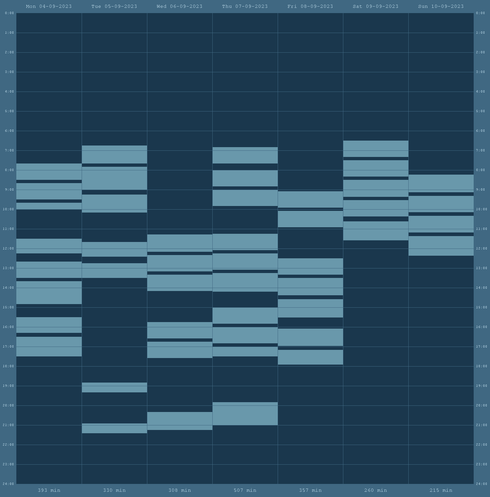

# Readme

## Getting Started
1. Clone the repository.
2. Create a new python virtual environment in the repository folder and activate it.
3. Install the required dependencies by running the command `pip install -r requirements.txt`.
4. Update the `DATAPATH` entry in the `.env` file to point to your [study hours file](#study-hour-file-syntax).
5. (Optional) Update the `SAVEPATH` entry in the `.env` file to point to a valid location. By default the output image is saved as `image.png` in the repository folder.
6. Execute the application by running the command `python -u src/application.py`.

## Study Hours File Syntax
The following is an example of the syntax:
```
29-09-2023 Arbitrary text
10.00-11.00 Read page 1 to 5
11.00-12.30 Read page 6 to 12

30-09-2023 More random text
07.00-09.00 Even more random text that is totally ignored

    31-09-2023    Leading and trailing spaces are fine    
  10.00-20.00    

29-09-2023 The data after this date replaces the previously specified data
Some other notes (this is ignored as this is not a date or time)
```

The study hours file is read line by line, leading and trailing spaces are ignored, as are tildes (for legacy reasons). When a date specification is encountered (of the format `dd-mm-yyyy`), all subsequent time specifications will be attached to that date. When a time specification is encountered (of the format `hh.mm-hh.mm`), the time specification is attached to the last date encountered. Date and time specifications cannot contain spaces.

If a date specification is encountered multiple times, only the last section of time specifications will be used.

## Environment Variables
### Paths
Environment variables are stored in an environment file called `.env`. The `DATAPATH` entry controls which file is interpreted as the study hours file. The `SAVEPATH` entry controls where the generated image is saved. Both of these variables can use the `$CWD$` macro to specify paths relative to the execution path of the application (which is probably the repository folder). Slashes are permitted after the `$CWD$` macro but are ignored, slashes can be added to make the path more readable. The following is an example of a path without the macro:

```
"C:\repo\study_hours_file.txt"
```

The following are examples of paths with the macro, these examples are all equivalent:

```
"$CWD$study_hours_file.txt"
"$CWD$\study_hours_file.txt"
"$CWD$/study_hours_file.txt"
"$CWD$\\/\/\/\/study_hours_file.txt"
```

### Color Palettes
Color palettes are defined in the environment file. A color palette consists of a list of four tuples, each of which contains an RGB color. The first color is used for the background, the second color is used for the surrounding bars, the third color is used for the study blocks, and the fourth color is used as the text color.

Several [predefined color palettes](#themes) are available. Custom color palettes can be added by adding the color palette to the environment file and adding the name of the color palette to the if statement at the start of the `load_color_palette()` function.

## Themes
### Purple


### Purple Dark


### Marine


### Marine Dark


### Marine Blue (Default)

